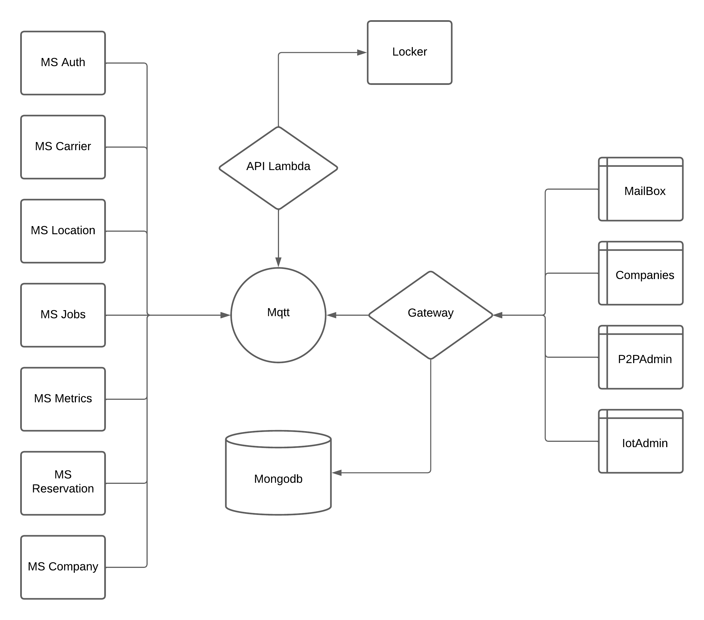

# Documentación del Sistema en GCP

## 1. Introducción
### 1.1. Descripción general del sistem
  El sistema está diseñado bajo una arquitectura modular basada en microservicios, desplegada en Google Cloud Platform (GCP) utilizando **Google Kubernetes Engine (GKE)** como entorno principal de ejecución. Esta infraestructura permite escalar de forma eficiente, mantener un despliegue continuo (CI/CD) y garantizar alta disponibilidad.
  
### 1.2. Diagrama de arquitectura 
    

### 1.3. Arquitectura General

La plataforma se divide en 3 capas principales:

#### 1.3.1. Frontend

Las interfaces web están orientadas a distintos tipos de usuarios y propósitos:

- **Mailbox**: Plataforma de interacción para usuarios finales.
- **Companies**: Portal de uso exclusivo para clientes corporativos.
- **p2pAdmin**: Herramienta de administración para operaciones internas.
- **iotAdmin**: Plataforma para gestionar los lockers físicos, permitiendo agregar nuevos dispositivos, verificar su estado de conexión y controlar su disponibilidad de espacios.

#### 1.3.2. Stream y Comunicación

- **MQTT**: Utilizado como canal de mensajería en tiempo real entre los microservicios, el Gateway y la API Lambda. Es clave para la interacción con los dispositivos IoT (Raspberry Pi en lockers).
- **MongoDB**: Base de datos NoSQL principal del sistema. Almacena información estructurada de los servicios, reservas, compañías, métricas y usuarios.

#### 1.3.3. Backend - API & Microservicios

- **Gateway**: Punto de entrada único que recibe todas las solicitudes externas y las redirige al microservicio correspondiente. Se encarga de la autenticación, enrutamiento y registro de logs.

- **API Lambda**: Conectada al Gateway y a los microservicios, facilita la comunicación directa con los dispositivos físicos (Raspberry Pi en lockers), utilizando MQTT para acciones como abrir lockers, actualizar estados, etc.


- **Microservicios (MS)**: Cada microservicio tiene una responsabilidad única dentro del sistema:

| Microservicio       | Descripción                                                                 |
|---------------------|-----------------------------------------------------------------------------|
| **ms-auth**         | Encargado de generar y validar tokens JWT para autenticar las solicitudes. |
| **ms-carrier**      | Gestiona información relacionada con transportistas o envíos.               |
| **ms-location**     | Proporciona servicios de localización geográfica.                           |
| **ms-jobs**         | Maneja procesos asincrónicos como envío de correos, SMS y tareas programadas. |
| **ms-metrics**      | Recopila y expone métricas de los demás microservicios.                     |
| **ms-reservation**  | Gestión completa de reservas: creación, cancelación, modificación.          |
| **ms-company**      | Administra compañías: alta, baja y edición de datos empresariales.          |

---

## 2. Estructura de Repositorios
### 2.1. Frontend
- **Descripción**:  
  Interfaces gráficas desarrolladas para distintos roles de usuario, como clientes, administradores operativos e ingenieros de soporte.

- **Tecnología utilizada**:  
  React, Angular.

- **Ubicación en GitHub**:  
  - [Loker-Mailbox-Admin](https://github.com/Chazki-Unified/Loker-Mailbox-Admin)  
  - [Loker-Admin-Web](https://github.com/Chazki-Unified/Loker-Admin-Web)  
  - [Loker-p2p-admin](https://github.com/Chazki-Unified/Loker-p2p-admin)  
  - [Loker-iot-Admin](https://github.com/Chazki-Unified/Loker-iot-Admin)  

- **Instrucciones**:
  - Clonar repositorio:  
    ```bash
    git clone <repositorio-url>
    ```
  - Instalar dependencias:  
    ```bash
    npm install
    ```
  - Ejecutar localmente:  
    ```bash
    npm start
    ```
- **Enlaces a versiones desplegadas**:  
  - [Mailbox](https://lockers-mailboxadmin.chazki.com/)
  - [Companies](https://lockers-companies.chazki.com/)
  - [P2padmin](https://lockers-p2padmin.chazki.com/)
  - [Iotadmin](https://lockers-iotadmin.chazki.com/)

### 2.2. Backend – API & Microservicios
- **Descripción**:  
  Conjunto de servicios desacoplados que siguen la arquitectura de microservicios. Estos se comunican entre sí y con el Gateway para brindar funcionalidades específicas.
- **Tecnología utilizada**:  
  Node.js.
- **Ubicación en GitHub**:  
  - API Gateway y Lambda
    - [Gateway](https://lockers-gateway.chazki.com/)  
    - [api lambda mqtt](https://github.com/Chazki-Unified/Loker-api-lambda-mqtt)
  - Microservicios
    - [MS Auth](https://github.com/Chazki-Unified/Loker-ms-Auth)  
    - [MS Carrier](https://github.com/Chazki-Unified/Loker-ms-Carrier)  
    - [MS Location](https://github.com/Chazki-Unified/Loker-ms-Location)  
    - [MS Jobs](https://github.com/Chazki-Unified/Loker-ms-Jobs)  
    - [MS Metrics](https://github.com/Chazki-Unified/Loker-ms-Metrics)
    - [MS Reservation](https://github.com/Chazki-Unified/Loker-ms-Reservation)
    - [MS Company](https://github.com/Chazki-Unified/Loker-ms-company)
- **Instrucciones**:
  - Clonar repositorio:  
    ```bash
    git clone <repositorio-url>
    ```
  - Instalar dependencias:  
    ```bash
    npm install 
    ```
  - Ejecutar localmente:  
    ```bash
    npm run start 
    ```
- **Enlaces a versiones desplegadas**:  
  - [Gateway](https://lockers-gateway.chazki.com/)

### 2.3. MQTT Stream
- **Descripción**:  
  Componente de mensajería basado en el protocolo MQTT. Utilizado para interacción entre microservicios y dispositivos IoT.
- **Tecnologías involucradas**:  
  EMQX v5.0.26.
- **Repositorio en GitHub**:  
  - [Loker-Mqtt](https://github.com/Chazki-Unified/Loker-Mqtt)
- **Instrucciones**:
  - Clonar repositorio:  
    ```bash
    git clone <repositorio-url>
    ```
  - Instalar dependencias:  
    ```bash
    npm install 
    ```
  - Ejecutar localmente:  
    ```bash
    npm run start
    ```
- **Enlaces a versiones desplegadas**:  
  - [Mqtt](https://lockers-mqtt.chazki.com/)

---

## 3. Automatización del Despliegue en GCP

### 3.1. Descripción de los Triggers en GCP

Los triggers configurados en Google Cloud Build permiten automatizar el proceso de construcción y despliegue de los microservicios. Cada microservicio tiene su propio repositorio y al menos un trigger asociado por entorno (por ejemplo, `beta`, `main`, etc.).

#### 3.1.1. Eventos que activan los triggers

Los triggers se activan automáticamente ante los siguientes eventos provenientes de GitHub:

- Push a ramas específicas (`main`, `beta`, `develop`)
- Creación de etiquetas (`tags`) o releases

#### 3.1.2. Configuración General de los Triggers

- **Tipo**: Cloud Build configuration file (YAML o JSON)
- **Ubicación del archivo de configuración**: Repositorio, generalmente en la ruta `/cloudbuild.yaml`
- **Región**: `global`
- **Repositorio conectado**: GitHub (mediante conexión de Cloud Build a GitHub)
- **Entorno de ejecución**: Se definen mediante variables de entorno utilizadas dentro del archivo `cloudbuild.yaml`

#### 3.1.3. Variables comunes utilizadas en los triggers

| Variable        | Descripción               | Ejemplo        |
|----------------|---------------------------|----------------|
| `_CLUSTER`     | Nombre del clúster GKE     | `prod`         |
| `_DOCKERFILE`   | Nombre del dockerfile    | `Containerd`  |
| `_ENVIRONMENT` | Nombre del entorno         | `beta`         |
| `_NAMESPACE`   | Namespace de Kubernetes    | `lockers`  |

#### 3.1.4. Ejemplo de Trigger: `MS-Carrier-beta`

- **Repositorio**: [MS Carrier](https://github.com/Chazki-Unified/Loker-ms-Carrier)  
- **Nombre del trigger**: `MS-Carrier-beta`  
- **Descripción**: Despliegue en entorno `beta`  
- **Rama monitoreada**: `beta`  
- **Tipo de configuración**: Archivo YAML (`/cloudbuild.yaml`)  
- **Región**: `global`  
- **Variables de entorno definidas**:
  - `_CLUSTER`: `prod`
  - `_ENVIRONMENT`: `beta`
  - `_NAMESPACE`: `lockers`

#### 3.1.5. Lista de Repositorios y Triggers Asociados

A continuación se presenta una lista de los microservicios y repositorios, los cuales siguen una configuración similar en sus respectivos triggers:

| Microservicio     | Repositorio                                                                 | Ejemplo de Trigger     | Rama  | Entorno |
|-------------------|------------------------------------------------------------------------------|-------------------------|--------|----------|
| Gateway           | [Gateway](https://lockers-gateway.chazki.com/)                              | `loker-API-gateway-prod`          | prod   | prod     |
| Gateway           | [Gateway](https://lockers-gateway.chazki.com/)                              | `loker-API-gateway-beta`          | beta   | beta     |
| MS Auth           | [MS Auth](https://github.com/Chazki-Unified/Loker-ms-Auth)                  | `loker-ms-Auth-prod`          | prod   | prod     |
| MS Auth           | [MS Auth](https://github.com/Chazki-Unified/Loker-ms-Auth)                  | `loker-ms-Auth-beta`          | beta   | beta     |
| MS Carrier        | [MS Carrier](https://github.com/Chazki-Unified/Loker-ms-Carrier)            | `loker-ms-Carrier-prod`       | prod   | prod     |
| MS Carrier        | [MS Carrier](https://github.com/Chazki-Unified/Loker-ms-Carrier)            | `loker-ms-Carrier-beta`       | beta   | beta     |
| MS Location       | [MS Location](https://github.com/Chazki-Unified/Loker-ms-Location)          | `loker-ms-Location-prod`      | prod   | prod     |
| MS Location       | [MS Location](https://github.com/Chazki-Unified/Loker-ms-Location)          | `loker-ms-Location-beta`      | beta   | beta     |
| MS Jobs           | [MS Jobs](https://github.com/Chazki-Unified/Loker-ms-Jobs)                  | `loker-ms-Jobs-prod`          | prod   | prod     |
| MS Jobs           | [MS Jobs](https://github.com/Chazki-Unified/Loker-ms-Jobs)                  | `loker-ms-Jobs-beta`          | beta   | beta     |
| MS Metrics        | [MS Metrics](https://github.com/Chazki-Unified/Loker-ms-Metrics)            | `loker-ms-Metrics-prod`       | prod   | prod     |
| MS Metrics        | [MS Metrics](https://github.com/Chazki-Unified/Loker-ms-Metrics)            | `loker-ms-Metrics-beta`       | beta   | beta     |
| MS Reservation    | [MS Reservation](https://github.com/Chazki-Unified/Loker-ms-Reservation)    | `loker-ms-Reservation-prod`   | prod   | prod     |
| MS Reservation    | [MS Reservation](https://github.com/Chazki-Unified/Loker-ms-Reservation)    | `loker-ms-Reservation-beta`   | beta   | beta     |
| MS Company        | [MS Company](https://github.com/Chazki-Unified/Loker-ms-company)            | `loker-ms-Company-prod`       | prod   | prod     |
| MS Company        | [MS Company](https://github.com/Chazki-Unified/Loker-ms-company)            | `loker-ms-Company-beta`       | beta   | beta     |
| API Lambda MQTT   | [API Lambda MQTT](https://github.com/Chazki-Unified/Loker-api-lambda-mqtt)  | `loker-API-lambda-mqtt-prod`         | prod   | prod     |
| API Lambda MQTT   | [API Lambda MQTT](https://github.com/Chazki-Unified/Loker-api-lambda-mqtt)  | `loker-API-lambda-mqtt-beta`         | beta   | beta     |
| Loker Mqtt   | [Loker Mqtt](https://github.com/Chazki-Unified/Loker-Mqtt)  | `loker-stream-mqtt-prod`         | prod   | prod     |
| Loker Mqtt   | [Loker Mqtt](https://github.com/Chazki-Unified/Loker-Mqtt)  | `loker-stream-mqtt-beta`         | beta   | beta     |
| Frontend Admin Web   | [Loker Admin Web](https://github.com/Chazki-Unified/Loker-Admin-Web)  | `loker-frontend-admin-web-prod`         | prod   | prod     |
| Frontend Admin Web   | [Loker Admin Web](https://github.com/Chazki-Unified/Loker-Admin-Web)  | `loker-frontend-admin-web-beta`         | beta   | beta     |
| Frontend iot Admin   | [Loker iot Admin](https://github.com/Chazki-Unified/Loker-iot-Admin)  | `loker-frontend-iot-admin-prod`         | prod   | prod     |
| Frontend iot Admin   | [Loker iot Admin](https://github.com/Chazki-Unified/Loker-iot-Admin)  | `loker-frontend-iot-admin-beta`         | beta   | beta     |
| Frontend Mailbox Admin   | [Loker Mailbox Admin](https://github.com/Chazki-Unified/Loker-Mailbox-Admin)  | `loker-frontend-mailbox-admin-prod`         | prod   | prod     |
| Frontend Mailbox Admin   | [Loker Mailbox Admin](https://github.com/Chazki-Unified/Loker-Mailbox-Admin)  | `loker-frontend-mailbox-admin-beta`         | beta   | beta     |
| Frontend p2p admin   | [Loker p2p admin](https://github.com/Chazki-Unified/Loker-p2p-admin)  | `loker-frontend-p2p-admin-prod`         | prod   | prod     |
| Frontend p2p admin   | [Loker p2p admin](https://github.com/Chazki-Unified/Loker-p2p-admin)  | `loker-frontend-p2p-admin-beta`         | beta   | beta     |


### 3.2. Generación de Imágenes de los Repositorios
- **Proceso de creación de imágenes**:  
  Se utiliza **Cloud Build** para crear imágenes Docker a partir de los repositorios de frontend, backend y MQTT.
- **Herramientas utilizadas**:  
  Docker, Cloud Build, Dockerfile, Containerd

### 3.3. Despliegue en el Cluster
- **Despliegue en Google Kubernetes Engine (GKE)**:  
  Una vez generadas las imágenes, los triggers despliegan las imágenes en un clúster de GKE utilizando Kubernetes.
- **Estrategias de despliegue**:  
  - Rolling Updates
  - Canary Releases

- **Instrucciones para verificar despliegue**:
  - Verificar los logs de GKE:
    ```bash
    gcloud logging read "resource.type=k8s_cluster"
    ```

---

## 4. Configuración de la Infraestructura en GCP

### 4.1. Recursos Utilizados en GCP

- **Servicios de GCP**:
  - **Google Kubernetes Engine (GKE)**: Clúster principal donde se despliegan todos los microservicios.
  - **Cloud Build**: Utilizado para la automatización del CI/CD y la creación de imágenes Docker.
  - **Cloud Logging**: Para la visualización de logs de los pods y servicios dentro del clúster.
  - **Container Registry / Artifact Registry**: Almacenamiento de imágenes Docker versionadas.

### 4.2. Configuración del Clúster GKE

- **Ubicación**: `us-central1-a`
- **Tipo de clúster**: Estándar (no Autopilot)
- **Actualización del Ingress Controller**: Se realizó una actualización manual del controlador de Ingress para mejorar la compatibilidad y el manejo del tráfico HTTP/HTTPS.
- **Node Pools**:
  - Se utiliza un node pool por entorno (por ejemplo, `ms-lockers`).
  - Este enfoque permite aislar recursos y optimizar la asignación por entorno (`dev`, `beta`, `prod`).
- **Balanceo de carga**: Gestionado a través del Ingress Controller actualizado.

### 4.3. Seguridad y Accesos

- **IAM Roles**:
  - Roles personalizados y predefinidos utilizados para controlar el acceso a recursos.
  - Separación de permisos entre usuarios de desarrollo, DevOps y servicios.
- **Namespaces en Kubernetes**:
  - Cada entorno y grupo de servicios está aislado mediante namespaces (por ejemplo, `lockers` ).

### 4.4. Red y Arquitectura

- **Red VPC**: Los nodos del clúster están conectados a una red VPC dedicada.
- **Control de acceso externo**:
  - El tráfico externo se controla mediante reglas en el Ingress Controller.
  - Políticas de firewall aplicadas a nivel de red GCP para restringir accesos innecesarios.

---

## 5. Procedimiento de Despliegue Manual
- **Proceso Manual de Despliegue**:
  En caso de que los triggers automáticos fallen, puedes seguir este proceso manual:
  - Construir imágenes Docker:
    ```bash
    docker build -t <image-name> .
    ```
  - Subir las imágenes a Container Registry:
    ```bash
    docker push <image-name>
    ```
  - Configurar el contexto de kubectl:
    ```bash
    gcloud container clusters get-credentials <cluster-name> --region <region> --project <project-id> 
    kubectl config set-context --current --namespace=lockers
    ```
  - Desplegar las imágenes en GKE:
    ```bash
    kubectl apply -f deployment.yaml
    ```
  - Rollback manual (opcional en caso de error):
    ```bash
    kubectl rollout undo deployment <deployment-name>
    ```

---

## 6. Monitoreo y Logs
### 6.1. Monitoreo de los Servicios
- **Herramientas de monitoreo**:
  - Cloud Monitoring
  - Prometheus
  - Grafana
  
- **Configuración de alertas**:
  - Notificaciones por fallos de microservicios, errores 5xx, o métricas críticas.

### 6.2. Revisión de Logs
- **Acceso a Logs**:
  - **Logs de GKE**:
    ```bash
    gcloud logging read "resource.type=k8s_cluster"
    ```

### 6.3. Dashboards
- Se dispone de dashboards en Grafana.
- Cloud Monitoring ofrece paneles de estado general del clúster.

### 6.4. Alertas
- Fallos en endpoints (5xx)
- Uso excesivo de CPU o memoria

### 6.5. Edición de Alertas
- Ubicación: Cloud Monitoring → Alertas → Editar condiciones

---

## 7. Escalabilidad y Optimización
### 7.1. Escalabilidad del Backend
- **Escalado automático en GKE**:  
  Los microservicios se escalan automáticamente según la demanda de recursos como la CPU y la memoria.

### 7.2. Optimización de Costos
- **Estrategias de optimización**:
  - Uso eficiente de recursos.
  - Pausar servicios no utilizados durante las horas no laborales.

### 7.3. Políticas de Escalado (HPA)
- Escalado horizontal basado en CPU al 70%
- Réplicas mínimas: 1
- Réplicas máximas: 5

### 7.4. Límites de Recursos
- Cada microservicio define `requests` y `limits` en su archivo de despliegue

### 7.5. Entornos diferenciados
- En entorno `beta`, las réplicas máximas están limitadas para controlar costos.

---

## 8. Mantenimiento y Actualizaciones
### 8.1. Estrategia de Mantenimiento
- **Actualización de microservicios o frontend**:  
  Si es necesario actualizar los microservicios o frontend, puedes seguir el flujo de CI/CD para actualizar los contenedores sin interrupciones.

### 8.2. Versionado y Releases
- Las actualizaciones siguen versionado semántico (semver)
- Las imágenes se etiquetan con número de versión y se almacenan en Artifact Registry

### 8.3. Post-actualización
- Monitorear logs y métricas durante los primeros 15 minutos
- Plan de rollback disponible con `kubectl rollout undo`

### 8.4. Actualización de Dependencias
- **Manejo de actualizaciones**:
  - Actualizar las dependencias utilizando los comandos correspondientes en frontend y backend.
  - Probar localmente y crear nuevas versiones de las imágenes antes de desplegar en GKE.

---

## 9. Resumen de Contacto y Soporte
- **Soporte Técnico**:
  - Contactar a soporte: [soporte@chazki.com](mailto:soporte@chazki.com)
  - Canal de Slack: `#pd-squad-lockers`

### 9.1. Horario de Soporte
- Lunes a viernes de 9:00 a 18:00 (GMT-5)

### 9.2. Escalamiento de Incidentes
- Nivel 1: Soporte interno (Slack)
- Nivel 2: Infraestructura (DevOps)
- Nivel 3: Contacto con GCP

---

## 10. Enlaces Útiles
- [Documentación de GKE](https://cloud.google.com/kubernetes-engine/docs)
- [Documentación de Cloud Build](https://cloud.google.com/build/docs)
- [Repositorios de GitHub](https://github.com/Chazki-Unified)
